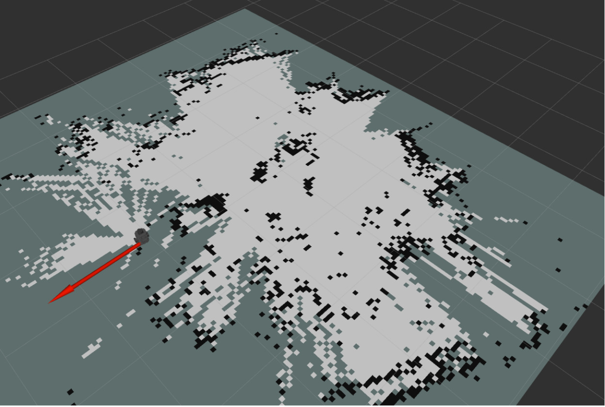
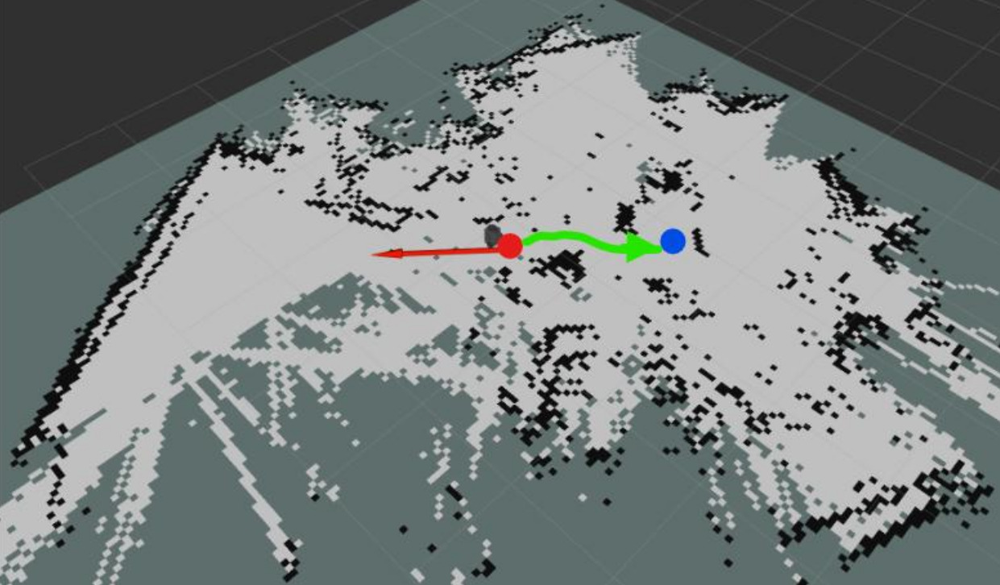

# TurtleBot3 Custom Navigation and Obstacle Avoidance

This project presents a fully custom, Python-based autonomous navigation system designed for the TurtleBot3 platform. The primary objective was to bypass the standard TurtleBot3 navigation library to process raw sensor data into direct motor commands, providing a transparent view of robot path planning and obstacle avoidance. 

## 🎥 Demonstration
https://github.com/user-attachments/assets/f8431380-71a2-4171-af0f-bb5f52502bad
*demo.mp4 is showing the obstacle avoidance capabilities using lidar*.

## ⚙️ System Overview
The system utilizes the `slam_toolbox` for reliable mapping and real-time location tracking. The active, real-time computational processing is performed directly on a Remote PC using SSH and ROS TOPICS to ensure minimal processing on the robot. The architecture is split into two distinct operational phases to prevent continuous, computationally heavy re-evaluation during exploration.

### Mode A: Exploration and Mapping
*   Utilizes SLAM to create an initial localized map.
*   Uses the Artificial Potential Field (APF) method for navigation.
*   Gives the robot the ability to explore unknown locations while successfully avoiding obstacles detected in the LDS-01 LiDAR data.

*Figure 1: Mode A shows the SLAM scan data that the robot recorded on its initial exploration through the room that uses APF to avoid obstacles detected in black. The red arrow shows the direction the robot is orientated.*.

### Mode B: Global Path Planning
*   Runs Dijkstra's algorithm to produce a global routing path on the grid biased scan from Mode A.
*   Navigates to a specified goal point provided by the user in the UI on a remote Ubuntu laptop.
*   A cost inflation layer was added to grid spaces directly next to walls, forcing the algorithm to draw paths down the center of hallways to prevent collisions.

*Figure 2: Mode B shows that the red point is the current location of the robot, the blue point is the destination set by the user, and the green line is the path that the robot took from the Dijkstra algorithm.*.

## 🛠️ Implementation Details
To ensure the custom code did not interfere with default TurtleBot operating files, the navigation logic was separated into a new ROS 2 Python package named `custom_tb3_nav`. 

*   **APF Controller (`apf_controller.py`)**: Uses vector math to create an "attractive force" pulling the robot toward waypoints and a "repulsive force" pushing it away from LiDAR-detected obstacles. These forces combine to dictate linear and angular speeds published to the `cmd_vel` topic.
*   **Dijkstra Explorer (`dijkstra_explorer.py`)**: Converts physical map coordinates into a discretized 2D mathematical grid to find the absolute shortest path to a goal by evaluating movement costs.
*   **Sensor Data Optimization**: The system uses the `qos_profile_sensor_data` Quality of Service (QoS) setting for ROS 2 to prioritize speed over perfect delivery, preventing crashes caused by delayed LiDAR data updates.

## 🚀 Future Improvements
*   **Algorithm Upgrade**: Replacing Dijkstra with an $A^*$ algorithm using a heuristic equation to calculate shortest paths faster and with less processing power, likely requiring upgraded onboard processing or remote computing.
*   **Dynamic Environments**: Updating the learned space map continuously and rerunning path planning to handle dynamic obstacles or positional drift.
